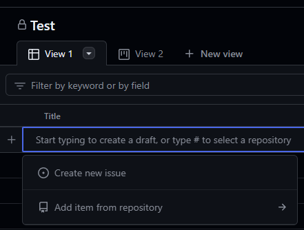
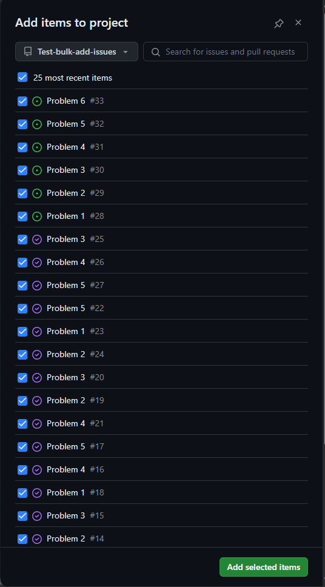

# Bulk-create-issues

This repo can be used to create multiple issues in this repo. You can afterwards add the issues to a project board.

## Usage

1. Update the `issues.csv` file with the issues you want to create.
   1. Remember to have a blank line at the end of the file. Else the last issue will not be created.
2. Commit and push the changes to the `issues.csv` file to the `main` branch.
3. The issues will be created automatically.
4. You can add the issues to a project board by adding the issues to the project board.
  1. Pres the `+` button in the project board and select `Add item from repository`. 
  2. Select the issues you want to add and press `Add selected items`. 

## What about labels?

You can add labels to the issues by adding a comma separated list of labels to the `labels` field in the `issues.csv` file.

If the label does not exist, it will be created.
